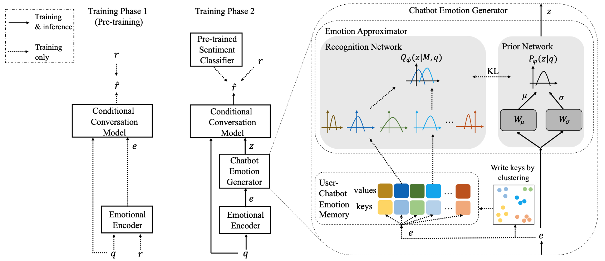
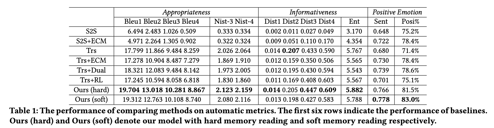

# EmoDiaChatbot
This is the accompany python package for the ACM MM 2021 paper：Empathetic and Emotionally Positive Conversation Systems with a Chatbot Emotion Generator (https://www.)

### Model Architecture


### Performance


### Requirements
- python==3.7
- pytorch==1.5.1
- torch==1.5.1
- tqdm==4.48.0
- tensorboard==1.14.0
- texar-pytorch==0.1.1
- transformers==2.11.0
- sklearn

### Configuration
#### 1.Preprocessing

Edit the `input`,`output_dict`,`output_src_tgt`,`output_src`,`output_tgt` in `build_vocab.sh`, then run the following shell command to build dict for your dataset.

```
sh data/build_data.sh
```

The `${output_dict}` file is the vocab you need for this dataset.
#### 2.Training
Run `run.sh` script file to start training, where `mark` means the personlized mark you set for this experiment (any string you want).
```
sh run.sh mark
```

After this shell command, you will see the generated log file (`log_${mark}` and `err_${mark}`) in `logs/` and checkpoints in `outputs/`. 


#### 3.Testing
Run `generate.sh` script file to start testing (inference/prediction), where `mark` means the personlized mark you set when training, and `pred_mark` means the personlized mark you set for this testing (any string you want).
```
sh generate.sh mark epoch_id pred_mark
```
After this shell command, you will see the generated log file (`logg_${mark}` and `errg_${mark}`) in `loggs/` and Bleu/Dist file in `results/`.

If you want to see both Bleu/Dist and sentiment results after running one script, then you can run the following shell command, where `mark` means the personlized mark you set when training, `top20` means TopKSampling during inference where K=20, `pred_mark` is the mark you set for the pretrained sentiment classifier.
```
sh generate_multi_epoches_and_test_sentiment_scores.sh mark top20 weibo_senti_100k
```
After this shell command, you will see the generated log file (`logg_${mark}` and `errg_${mark}`) in `loggs/` and Bleu/Dist file in `results/`, also you can find sentiment files in `Bert/pred_labels/`.